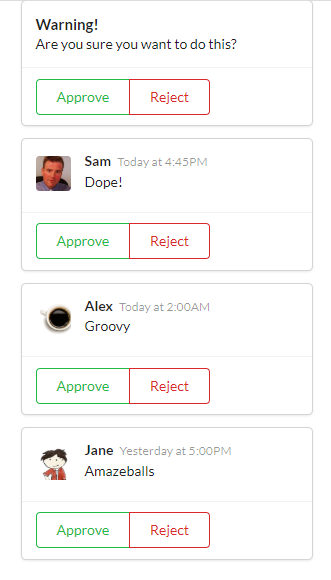
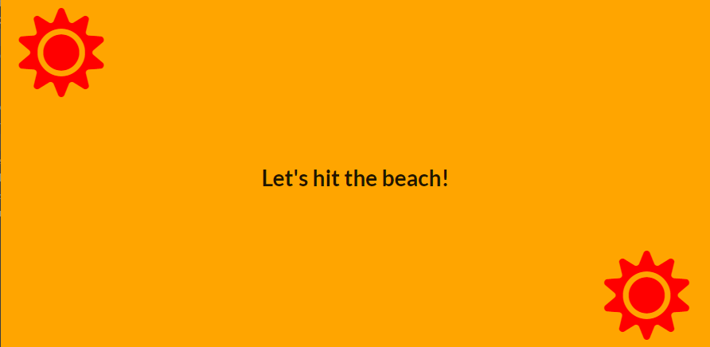
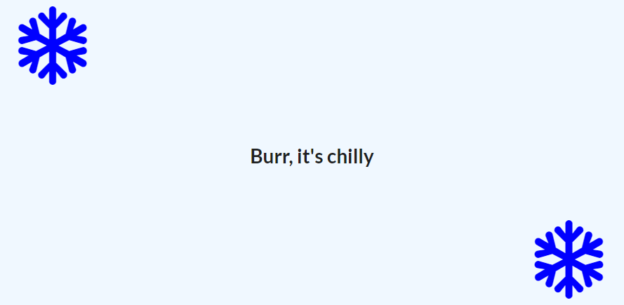
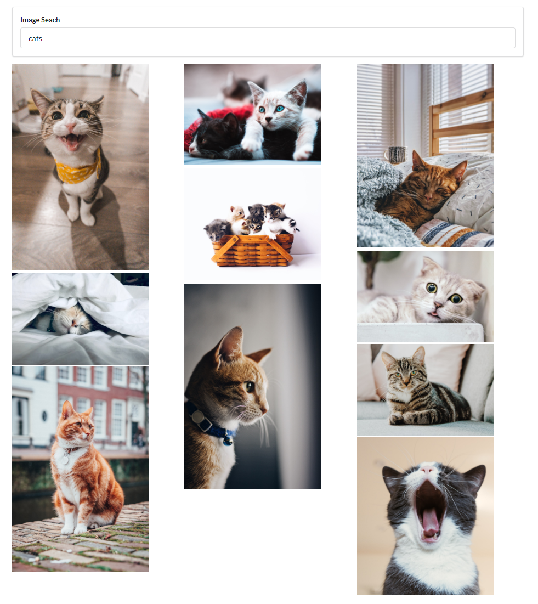
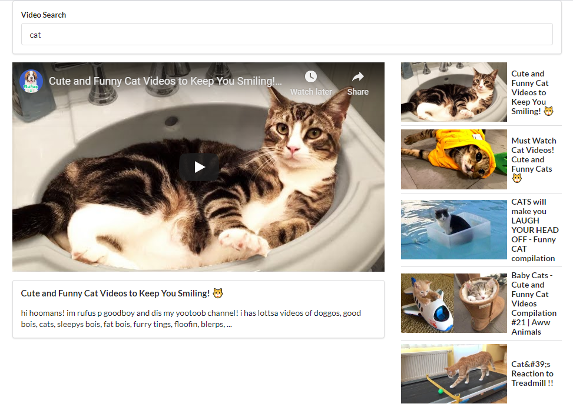
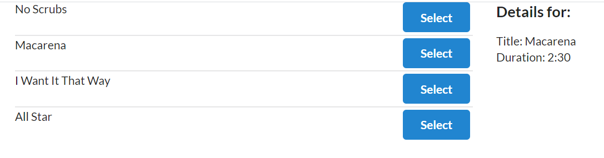
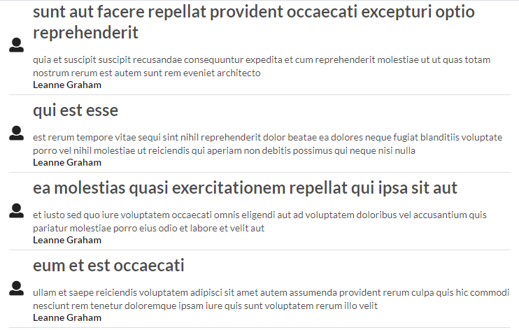

# React/Redux

"Modern React with Redux" by Stephen Grider on Udemy.

Uploading all of the projects as I go!

## **1. JSX**
***Library:*** React

This "app" contains several mini lesson components on JSX in the src directory.

## **2. COMMENTS**
***Library:*** React

An app that renders comment components that need to be approved or rejected such as what you might see as a blog owner. The below screenshot represents the app as it was created for this Udemy project.

  

## **3. SEASONS**
***Library:*** React

An app that renders a seasonal message depending on whether the user's location is currently experiencing Summer or Winter. Handles blocked location requests and loading message as well. The below screenshots represents the app as it was created for this Udemy project.

  

  

  

## **4. PICS**
***Library:*** React

An app that renders relevant images from search terms using the Unsplash API. The below screenshot represents the app as it was created for this Udemy project.

  

## **5. VIDEOS**
***Library:*** React

An app that renders videos from the Youtube API. Defaults to popular Youtube videos but a search term can bring up relevant results. The below screenshot represents the app as it was created for this Udemy project.

  

## **6. SONGS**
***Library:*** React-Redux

An app that renders hard-coded song information when a song is selected. Utilizes react-redux. The below screenshot represents the app as it was created for this Udemy project.

  

## **7. BLOG**
***Library:*** React-Redux

An app that renders blog posts from the JSONPlaceholder API. The below screenshot represents the app as it was created for this Udemy project.

  

